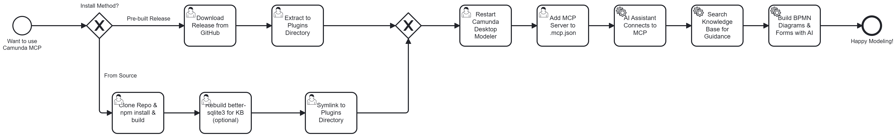
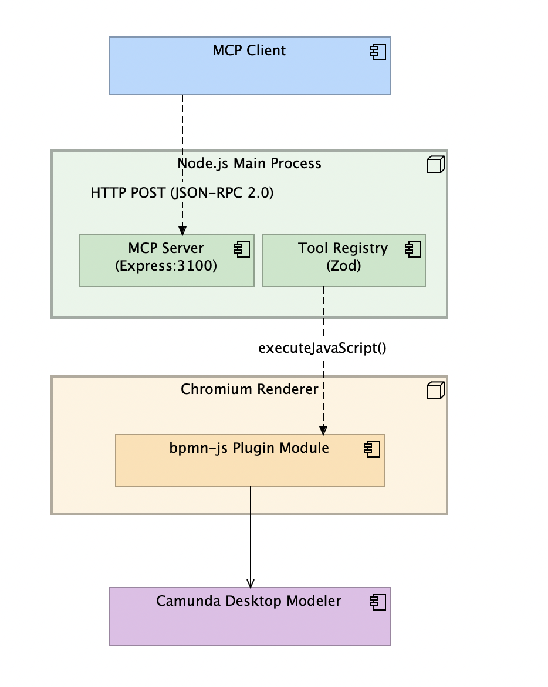

# Camunda Desktop Modeler MCP Plugin

**v0.8.0**

## Overview

This plugin adds an [MCP (Model Context Protocol)](https://modelcontextprotocol.io/) HTTP server to the Camunda Desktop Modeler. Once loaded, AI coding assistants such as Claude Code, Claude Desktop, and GitHub Copilot can create and manipulate BPMN diagrams and Camunda Forms inside the live Modeler through standard MCP tool calls.

The plugin ships with 30 tools covering the full BPMN modeling lifecycle: placing elements (tasks, events, gateways, sub-processes), connecting them with sequence flows, configuring properties and implementation details (Camunda 7 and 8), managing I/O mappings and task headers, introspecting diagrams, and importing/exporting BPMN 2.0 XML. It also supports creating and linking Camunda Forms.

## Getting Started



*This diagram was built entirely by AI using the plugin itself.*

## Architecture



*Architecture model created with [Archi](https://www.archimatetool.com/) via the [Archi MCP Plugin](https://github.com/tobi/archi-mcp-server).*

The plugin runs across two Electron processes connected by a renderer bridge.

**Request lifecycle:**

1. MCP client sends `POST /mcp` with a JSON-RPC tool call
2. The MCP SDK routes the call to the registered tool handler
3. **Local tools** (e.g. `create_model`, `create_form`) execute directly in Node.js
4. **Renderer tools** (e.g. `add_start_event`, `add_task`) are forwarded to the Chromium renderer via `webContents.executeJavaScript()`, which calls `window.__mcpDispatch()` -- a global function registered by the bpmn-js plugin module
5. The renderer calls the bpmn-js API (`modeling.createShape`, `modeling.connect`, `modeling.updateLabel`, etc.) and returns the result
6. The MCP server returns the JSON-RPC response to the client

**Why `executeJavaScript` instead of IPC?** The Camunda Modeler runs with `contextIsolation` enabled, which prevents plugin scripts from accessing `ipcRenderer`. The `executeJavaScript` bridge bypasses this by calling a global function directly from the main process.

## Available Tools

### BPMN Diagram Tools

| Tool | Parameters | Description |
|------|-----------|-------------|
| `create_model` | `name` (string, optional) | Creates a new empty BPMN diagram. Writes minimal BPMN XML to a temp file and opens it in the Modeler. Returns `{ diagramId, filePath, message }`. |
| `add_start_event` | `diagramId`, `name` (default `"Start"`), `x` (default `200`), `y` (default `200`), `parentId` (optional) | Places a BPMN Start Event on the canvas. Use `parentId` to nest inside an expanded subprocess. Returns `{ elementId, name, x, y }`. |
| `add_task` | `diagramId`, `type` (default `"bpmn:Task"`), `name`, `x` (default `400`), `y` (default `200`), `parentId` (optional) | Places a BPMN Task on the canvas. Use `parentId` to nest inside an expanded subprocess. Supported types: `bpmn:UserTask`, `bpmn:ServiceTask`, `bpmn:Task`, `bpmn:SendTask`, `bpmn:ReceiveTask`, `bpmn:ScriptTask`, `bpmn:BusinessRuleTask`, `bpmn:ManualTask`. Returns `{ elementId, type, name, x, y }`. |
| `add_end_event` | `diagramId`, `name`, `x` (default `600`), `y` (default `200`), `parentId` (optional) | Places a BPMN End Event on the canvas. Use `parentId` to nest inside an expanded subprocess. Returns `{ elementId, name, x, y }`. |
| `connect_elements` | `diagramId`, `sourceId`, `targetId`, `waypoints` (optional array of `{x, y}`) | Connects two BPMN elements with a sequence flow. Use `waypoints` for custom routing (L-shaped, orthogonal). Returns `{ connectionId, sourceId, targetId }`. |
| `add_gateway` | `diagramId`, `type` (default `"bpmn:ExclusiveGateway"`), `name`, `x`, `y`, `parentId` (optional) | Places a BPMN Gateway. Use `parentId` to nest inside an expanded subprocess. Types: `bpmn:ExclusiveGateway`, `bpmn:ParallelGateway`, `bpmn:InclusiveGateway`, `bpmn:EventBasedGateway`. |
| `add_event` | `diagramId`, `type` (`IntermediateCatchEvent` / `IntermediateThrowEvent` / `BoundaryEvent`), `eventDefinitionType` (Timer, Message, Signal, Error, etc. or `"none"`), `name`, `x`, `y`, `attachedToId` (for BoundaryEvent), `cancelActivity`, `timerValue`, `timerType`, `parentId` (optional) | Places an Intermediate or Boundary Event with an optional event definition. Use `parentId` to nest inside an expanded subprocess (ignored for BoundaryEvent). |
| `add_subprocess` | `diagramId`, `type` (default `"bpmn:SubProcess"`), `name`, `x`, `y`, `width`, `height`, `collapsed`, `calledElement` (for CallActivity), `parentId` (optional) | Places a SubProcess (expanded/collapsed) or CallActivity. Use `parentId` to nest inside an expanded subprocess. |

### Element Configuration Tools

| Tool | Parameters | Description |
|------|-----------|-------------|
| `set_properties` | `diagramId`, `elementId`, `name`, `documentation`, `conditionExpression`, `implementationType` (`class` / `delegateExpression` / `expression` / `external` / `connector`), `implementationValue`, `taskTopic`, `taskPriority`, `taskType` (Zeebe job type), `taskRetries`, `isExecutable` | Sets element properties: name, documentation, conditions, and implementation type for Camunda 7 or Camunda 8. |
| `set_io_mapping` | `diagramId`, `elementId`, `inputs` (array of `{ source, target }`), `outputs` (array of `{ source, target }`) | Sets input/output variable mappings. Supports both Camunda 7 and Camunda 8 formats. |
| `set_task_headers` | `diagramId`, `elementId`, `headers` (array of `{ key, value }`) | Sets key-value task headers. Camunda 8: `zeebe:TaskHeaders`. Camunda 7: `camunda:Properties`. |

### Diagram Introspection Tools

| Tool | Parameters | Description |
|------|-----------|-------------|
| `list_elements` | `diagramId`, `typeFilter` (optional, e.g. `"bpmn:Task"`) | Lists all BPMN elements in the current diagram with optional type filter. |
| `get_element` | `diagramId`, `elementId` | Returns detailed info about a specific element including properties, extensions, and connections. |
| `delete_element` | `diagramId`, `elementId` | Removes an element from the diagram. |
| `get_diagram_xml` | `diagramId` | Exports the current diagram as BPMN 2.0 XML. |
| `import_xml` | `diagramId`, `xml` (string) | Imports/replaces the current diagram from BPMN 2.0 XML. |
| `move_element` | `diagramId`, `elementId`, `x`, `y` | Moves an element to new center coordinates. |
| `save_diagram` | `diagramId`, `filePath` | Saves the current diagram as BPMN XML to a file path. |

### Collaboration Tools

| Tool | Parameters | Description |
|------|-----------|-------------|
| `add_participant` | `diagramId`, `name`, `x`, `y`, `width`, `height` | Adds a pool (bpmn:Participant) for collaboration diagrams. |
| `add_lane` | `diagramId`, `participantId`, `name` | Adds a lane inside a participant (pool). |
| `add_message_flow` | `diagramId`, `sourceId`, `targetId`, `name` (optional) | Creates a message flow between elements in different pools. |
| `add_end_event_typed` | `diagramId`, `eventDefinitionType` (Error, Signal, Message, Terminate, etc.), `name`, `x`, `y`, `parentId` (optional) | Places a typed End Event on the canvas. Use `parentId` to nest inside an expanded subprocess. |
| `add_annotation` | `diagramId`, `text`, `x`, `y`, `attachToId` (optional) | Adds a text annotation, optionally associated with an element. |

### Camunda Forms Tools

| Tool | Parameters | Description |
|------|-----------|-------------|
| `create_form` | `name`, `fields` (optional array of field definitions) | Creates a new Camunda Form (`.form`) JSON file. Each field has `key`, `label`, `type`, `required`, `description`, and `options` (for select/radio). Returns `{ formId, filePath, fieldCount }`. |
| `add_form_field` | `formPath`, `key`, `label`, `type` (default `"textfield"`), `required`, `description`, `options` | Adds a field to an existing `.form` file. Supported types: `textfield`, `textarea`, `number`, `checkbox`, `select`, `radio`, `taglist`, `datetime`. Returns `{ fieldId, key, fieldCount }`. |
| `link_form_to_task` | `diagramId`, `taskId`, `formPath` | Links a Camunda Form to a UserTask in the BPMN model. Auto-detects Camunda 8 (Zeebe) or Camunda 7 (Platform) mode and sets the appropriate extension elements. Returns `{ taskId, formId, mode }`. |

### DMN & Deployment Tools

| Tool | Parameters | Description |
|------|-----------|-------------|
| `create_dmn` | `name`, `tableName`, `hitPolicy` (UNIQUE/FIRST/etc.), `inputs`, `outputs` | Creates a DMN decision table file with configured inputs, outputs, and hit policy. |
| `deploy_process` | `filePath`, `clusterUrl`, `clientId`, `clientSecret` | Deploys a BPMN process to Camunda 8 Zeebe. Requires `ZEEBE_ADDRESS`, `ZEEBE_CLIENT_ID`, `ZEEBE_CLIENT_SECRET` env vars. |

### Tab Management Tools

| Tool | Parameters | Description |
|------|-----------|-------------|
| `list_open_diagrams` | *(none)* | Lists all open diagram tabs with their IDs, names, types, file paths, and active status. Tabs are discovered as they become active. |
| `switch_diagram` | `diagramId` (optional), `filePath` (optional), `name` (optional, partial match) | Switches to a specific diagram tab. At least one parameter required. Returns an error listing matches if multiple tabs match, or known tabs if none match. |

### Authentication

Set the `MCP_API_KEY` environment variable to enable Bearer token authentication on the MCP endpoint. When set, all requests must include `Authorization: Bearer <key>`. When unset, no auth (backwards compatible).

## Prerequisites

- **Camunda Desktop Modeler** v5.x (Electron-based)
- **Node.js** >= 20
- **npm** >= 9

## Installation

1. **Clone and install dependencies:**

   ```bash
   git clone https://github.com/JesseLeresche/Camunda-mcp.git
   cd Camunda-mcp
   npm install
   ```

2. **Build the plugin:**

   ```bash
   npm run build
   ```

   This runs two compilation steps:
   - `tsc` compiles the Node.js-side TypeScript (`src/`) to `dist/`
   - `webpack` bundles the renderer-side TypeScript (`client/`) to `client/dist/client.js`

3. **Symlink into the Camunda Modeler plugins directory:**

   ```bash
   # macOS
   ln -s "$(pwd)" ~/Library/Application\ Support/camunda-modeler/resources/plugins/camunda-mcp

   # Linux
   ln -s "$(pwd)" ~/.config/camunda-modeler/resources/plugins/camunda-mcp

   # Windows (run as Administrator)
   mklink /d "%APPDATA%\camunda-modeler\resources\plugins\camunda-mcp" C:\path\to\Camunda-mcp
   ```

4. **Restart the Camunda Desktop Modeler.** The plugin will load automatically. Check the **Plugins** menu for "MCP Server: Running (port 3100)".

## MCP Client Configuration

Add the following to your project's `.mcp.json` (Claude Code / Claude Desktop):

```json
{
  "mcpServers": {
    "camunda-modeler": {
      "type": "http",
      "url": "http://localhost:3100/mcp"
    }
  }
}
```

The port defaults to `3100` and can be changed by setting the `MCP_PORT` environment variable before launching the Modeler. If port 3100 is in use, the server automatically retries up to 3 consecutive ports (3100, 3101, 3102).

## Development

### Watch mode

Run both the TypeScript compiler and webpack in watch mode for iterative development:

```bash
npm run dev
```

After making changes, hot-reload inside the Modeler with **F12** (open DevTools) then **Cmd+R**. A full Modeler restart is only needed when server-side tool registrations change.

### Adding new tools

Every tool follows the same pattern across three files:

1. **`src/tools/registry.ts`** -- Define a Zod input schema and add a `ToolDefinition` entry to the `tools` array. Set `executeLocal: true` for Node.js-side tools or `executeLocal: false` for tools that need bpmn-js API access.

2. **`src/tools/handlers.ts`** -- Add a `case` to the `dispatch()` switch. Local tools implement their logic here directly. Renderer tools forward via `ipcBridge(toolName, params)`.

3. **`client/bpmn-tools.ts`** -- For renderer tools, add a `case` to `dispatchRendererTool()` and implement the bpmn-js API call using the injected services: `modeling`, `elementRegistry`, `canvas`, `moddle`, `bpmnFactory`, `injector`.

## Project Structure

```
camunda-mcp/
├── index.js                        # Plugin entry point (plain JS, required by Modeler)
├── menu.js                         # Menu plugin (plain JS, shows server status)
├── package.json                    # Dependencies and build scripts
├── tsconfig.json                   # TypeScript config for Node.js side (src/ -> dist/)
├── tsconfig.client.json            # TypeScript config for renderer side (client/)
├── webpack.config.js               # Webpack config: bundles client/ -> client/dist/client.js
├── src/
│   ├── server.ts                   # MCP HTTP server (Express + SDK) + renderer bridge
│   ├── menu.ts                     # Menu status tracking (updateMenuStatus, getMenuLabel)
│   └── tools/
│       ├── registry.ts             # Tool definitions with Zod input schemas
│       └── handlers.ts             # Dispatch router + local tool handlers (createModel, createForm, addFormField)
├── client/
│   ├── client.ts                   # Renderer entry: registers bpmn-js plugin + tab manager
│   ├── bpmn-tools.ts               # bpmn-js DI module, renderer tool implementations
│   ├── tab-manager.ts              # Client extension for tab tracking and switching
│   ├── types.d.ts                  # Type declarations for camunda-modeler-plugin-helpers + React
│   └── dist/
│       └── client.js               # Webpack output (generated, not checked in)
└── dist/                           # tsc output (generated, not checked in)
```

## Known Limitations

- **`diagramId` is informational only.** Renderer tools operate on the currently active diagram tab regardless of the `diagramId` parameter. Use `switch_diagram` to activate the correct tab before calling renderer tools.
- **Tab discovery is incremental.** `list_open_diagrams` only returns tabs that have been focused at least once since the plugin loaded. Switch to a tab to register it.
- **Authentication is optional.** Set `MCP_API_KEY` env var to enable Bearer token auth. Without it, the server is open on localhost.
- **Single-window support.** The renderer bridge targets `BrowserWindow.getAllWindows()[0]`.
- **Form linking in Camunda 8 mode.** Embedding forms via `zeebe:UserTaskForm` depends on the Modeler's moddle extensions. Falls back to `formId` reference if unavailable.
- **Port conflicts.** The server retries up to 3 ports. If all are in use, startup fails.
- **Streaming transport:** The server currently uses stateless Streamable HTTP. Server-Sent Events for real-time diagram change notifications is planned for a future release.

## Verification / Testing

### Quick smoke test

After installing and starting the Modeler, verify with curl (note: `Accept` header must include `text/event-stream`):

```bash
# Initialize
curl -s -X POST http://localhost:3100/mcp \
  -H 'Content-Type: application/json' \
  -H 'Accept: application/json, text/event-stream' \
  -d '{"jsonrpc":"2.0","method":"initialize","params":{"protocolVersion":"2025-03-26","capabilities":{},"clientInfo":{"name":"test","version":"1.0"}},"id":1}'

# List tools
curl -s -X POST http://localhost:3100/mcp \
  -H 'Content-Type: application/json' \
  -H 'Accept: application/json, text/event-stream' \
  -d '{"jsonrpc":"2.0","method":"tools/list","id":2}'

# Create a diagram
curl -s -X POST http://localhost:3100/mcp \
  -H 'Content-Type: application/json' \
  -H 'Accept: application/json, text/event-stream' \
  -d '{"jsonrpc":"2.0","method":"tools/call","params":{"name":"create_model","arguments":{"name":"test"}},"id":3}'

# Add a start event
curl -s -X POST http://localhost:3100/mcp \
  -H 'Content-Type: application/json' \
  -H 'Accept: application/json, text/event-stream' \
  -d '{"jsonrpc":"2.0","method":"tools/call","params":{"name":"add_start_event","arguments":{"diagramId":"d","name":"Begin","x":200,"y":200}},"id":4}'
```

### Full E2E workflow test

| Step | Action | Expected Outcome |
|------|--------|-----------------|
| 1 | Open Camunda Desktop Modeler | Plugin loads. HTTP server on port 3100. Plugins menu shows status. |
| 2 | `create_model` | New empty BPMN diagram tab opens. |
| 3 | `add_start_event` | Start Event circle appears with label. |
| 4 | `add_task` (UserTask, name: "Review Request") | User Task rectangle appears with label. |
| 5 | `add_gateway` (ExclusiveGateway, name: "Approved?") | Gateway diamond appears with label. |
| 6 | `add_task` (ServiceTask, name: "Process Order") | Service Task rectangle appears. |
| 7 | `add_task` (ServiceTask, name: "Send Rejection") | Second Service Task appears. |
| 8 | `add_end_event` (x2, "Done" and "Rejected") | Two End Events appear. |
| 9 | `connect_elements` (Start -> UserTask -> Gateway, Gateway -> each branch -> End Events) | Sequence flows connect all elements. |
| 10 | `set_properties` (conditionExpression on gateway outgoing flows) | Conditions appear on sequence flows in properties panel. |
| 11 | `set_properties` (taskType: "order-processing" on ServiceTask) | Zeebe job type set on ServiceTask. |
| 12 | `set_io_mapping` (inputs/outputs on ServiceTask) | I/O mappings visible in properties panel. |
| 13 | `set_task_headers` (headers on ServiceTask) | Task headers visible in properties panel. |
| 14 | `create_form` with fields | `.form` file created with field definitions. |
| 15 | `link_form_to_task` | Form linked to UserTask (visible in properties panel). |
| 16 | `list_elements` | Returns all elements with correct types. |
| 17 | `get_element` (on the gateway) | Returns gateway details including connections. |
| 18 | `get_diagram_xml` | Returns valid BPMN 2.0 XML with all elements and extensions. |
| 19 | Save diagram | `.bpmn` XML contains all elements, conditions, and form reference. |

## License

MIT
