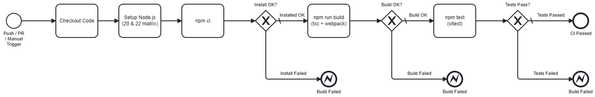
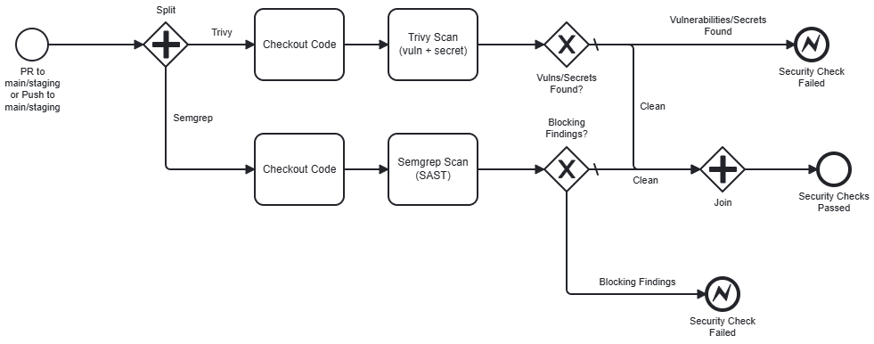
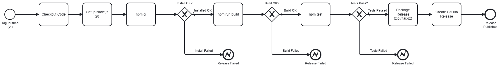
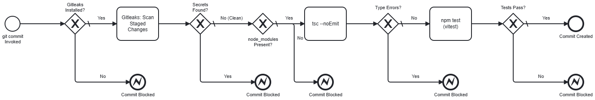

# Camunda-MCP — CI/CD Pipeline

What runs on every push/PR, what runs at release time, and what runs locally before a commit even
happens. For the plugin's own runtime architecture, see [`architecture.md`](./architecture.md).

## At a glance

| Workflow | Triggers | What it does |
|---|---|---|
| [`ci.yml`](../.github/workflows/ci.yml) | `push` (any branch), `pull_request` (`opened`/`synchronize`/`reopened` → `main`/`staging`), `workflow_dispatch` | Build + test, Node 20 and 22 |
| [`security.yml`](../.github/workflows/security.yml) | `pull_request` (→ `main`/`staging`), `push` (`main`/`staging`), `workflow_dispatch` | Trivy (dependency + secret scan), Semgrep (SAST) |
| [`release.yml`](../.github/workflows/release.yml) | `push` (tags `v*`) | Builds and publishes a GitHub Release with packaged zip/tar.gz |
| [`dependabot.yml`](../.github/dependabot.yml) | weekly schedule | Version-update PRs for npm deps + GitHub Actions |
| `.husky/pre-commit` | every local `git commit` | Fast subset of the above, before the commit even happens |

## Tools used

- **[Trivy](https://trivy.dev/)** — open-source scanner for dependency vulnerabilities, misconfigurations, and secrets. **TL;DR:** checks `package-lock.json` for known-CVE dependencies and scans the repo for leaked credentials, in `security.yml`.
- **[Semgrep](https://semgrep.dev/)** — static analysis (SAST) engine that pattern-matches source code for bugs and vulnerability-prone code without running it. **TL;DR:** free Community Edition rules catch things like path traversal, injection risks, and insecure defaults, in `security.yml`.
- **[Husky](https://typicode.github.io/husky/)** — the tool that wires up this repo's git hooks. **TL;DR:** auto-configures `core.hooksPath` on every `npm install` so `.husky/pre-commit` runs for every developer with zero manual setup.

## `ci.yml` — build & test

Runs `npm ci` → `npm run build` (`tsc` + webpack production bundle) → `npm test` (vitest), on a
matrix of **Node 20 and 22** — catches a build/test failure that only shows up on one Node version.



*(Source: [`pipelines/ci-pipeline.bpmn`](./pipelines/ci-pipeline.bpmn) — open in the Modeler to edit.)*

**Triggers, and why they're shaped this way:**
- `push` has no branch filter, so it covers pushes to feature branches (fast feedback before a PR
  even exists), pushes straight to `main`, and merges into `main` (a merge is just a push).
- `pull_request` is scoped to `main` and `staging` as base branches, with `opened`/`synchronize`/
  `reopened` so it re-runs on every new commit pushed to an open PR, not just when the PR is first
  opened.
- `workflow_dispatch` lets you re-run it on demand from the Actions tab (or `gh workflow run`)
  against any branch — but see the [Husky](#pre-commit-hook-husky) caveat below on `workflow_dispatch`
  only being available once a workflow file is merged to the default branch.

## `security.yml` — scans



*(Source: [`pipelines/security-pipeline.bpmn`](./pipelines/security-pipeline.bpmn).)*

Two independent jobs, run in parallel:

- **Trivy** (`aquasecurity/trivy-action`) — filesystem scan (`scan-type: fs`) with
  `scanners: vuln,secret`. Checks `package-lock.json` for dependencies with known CVEs
  (`severity: CRITICAL,HIGH`, `exit-code: 1` so it actually fails the check) and scans the repo for
  accidentally committed secrets. `GITHUB_TOKEN` is passed into the step's env specifically to
  authenticate the `trivy-db` pull from GHCR — anonymous pulls there are rate-limited.
- **Semgrep Community Edition** — runs in the official `semgrep/semgrep` container,
  `semgrep scan --config auto --error`. Free community rulesets, no `SEMGREP_APP_TOKEN` needed
  (that's only required for the paid AppSec Platform features — PR comments, dashboards, private
  rules — none of which we use).

**Why Semgrep instead of CodeQL:** CodeQL code scanning requires a paid GitHub Advanced Security
license on private repositories. Semgrep CE is free regardless of repo visibility and needs no
account for its community ruleset, so it fills the same SAST gap at zero cost.

**Triggers deliberately don't include bare feature-branch pushes.** Both scans are slow relative to
`ci.yml` (Trivy's DB pull, Semgrep's container + full-repo scan), so they're gated on PR events and
pushes to `main`/`staging` — the actual merge gates — rather than running on every WIP commit.

## `release.yml`

Unchanged in behavior from before this work, other than the hardening below: on a `v*` tag push, it
builds, tests, packages a `zip`/`tar.gz` of the plugin (`index.js`, `menu.js`, `dist/`,
`client/dist/`, `docs/`, production `node_modules`), and publishes a GitHub Release with
auto-generated release notes.



*(Source: [`pipelines/release-pipeline.bpmn`](./pipelines/release-pipeline.bpmn).)*

## Supply-chain hardening: actions pinned to commit SHAs

Every `uses:` step across all three workflows is pinned to a full 40-character commit SHA (with the
version as a trailing comment, e.g. `actions/checkout@11d5960a...677262 # v4`) instead of a mutable
tag like `@v4`. A tag can be silently repointed by the action's maintainer — or an attacker who
compromises that maintainer's account — which is exactly what happened in real supply-chain
incidents affecting `tj-actions` and (ironically) `trivy-action` itself. Pinning to the SHA a tag
currently resolves to is a no-op for behavior (it's the literal same code) but closes that risk.
Dependabot's `github-actions` ecosystem entry understands SHA-pinned actions and still opens bump
PRs for them.

`release.yml` also had `${{ github.ref_name }}` moved out of a `run:` shell block into an `env:`
var — interpolating `github` context data directly into a shell script is a script-injection risk
(a maliciously crafted tag name could inject shell commands); routing it through `env:` lets the
runner handle escaping properly instead of GitHub doing a raw text substitution into the script.

## Concurrency: avoiding duplicate runs

A push to a branch with an open PR fires **both** a `push` event and a `pull_request:synchronize`
event for the same commit — without handling this, both workflows would run twice for identical
code. Each workflow has a `concurrency` group keyed on the commit's SHA:

```yaml
concurrency:
  group: ci-${{ github.event.pull_request.head.sha || github.sha }}
  cancel-in-progress: true
```

`github.sha` on a `pull_request` event is a synthetic merge commit, not the branch's actual head
commit — that's why `github.event.pull_request.head.sha` is preferred, falling back to `github.sha`
for `push`/`workflow_dispatch` events where no such synthetic commit exists. When both events land
for the same real commit, they resolve to the same group key, and `cancel-in-progress: true` cancels
whichever run started first. This has been observed working in practice — see PR #33, where the
`push`-triggered `build-and-test` runs were cleanly cancelled in favor of the `pull_request`-triggered
ones for the same commit.

## Pre-commit hook (Husky)

A local `git commit` runs a fast subset of the above before the commit is even created, so problems
surface immediately instead of on the next push.



*(Source: [`pipelines/pre-commit-hook.bpmn`](./pipelines/pre-commit-hook.bpmn).)*

**How it's wired up:** [Husky](https://github.com/typicode/husky) is an npm devDependency. It adds a
`"prepare": "husky"` script to `package.json` — `prepare` is an npm lifecycle script that runs
automatically on every `npm install`, and all it does is point git's `core.hooksPath` at the repo's
tracked `.husky/` directory. That means every developer gets the hook active the moment they run a
normal `npm install` after cloning or pulling — no manual `git config` step to remember, no
opt-in ceremony. (One caveat: it only activates on someone's *next* `npm install`, not instantly on
`git pull` alone — a non-issue in practice, since `ci.yml`/`security.yml` still catch anything that
slips through for a developer who hasn't reinstalled yet.)

**`.husky/pre-commit`**, in order (any failure aborts the commit immediately, via `set -e`):

1. **Gitleaks** (`gitleaks protect --staged`) — secret scanning limited to what's actually staged.
   Gitleaks runs here instead of Trivy specifically because Trivy's `fs` scanner has no "staged
   files only" mode — it just walks a directory tree — while Gitleaks' `protect` mode was purpose-built
   for exactly this pre-commit scoping.
2. **`tsc --noEmit`** — mirrors the type-check half of `ci.yml`'s build step. Deliberately skips the
   webpack bundle step to stay fast; a pre-commit hook should be a quick sanity check, not a full CI
   run, and bundling errors are rare enough from a routine commit that catching them on push (where
   `ci.yml` still runs the real `npm run build`) is an acceptable tradeoff.
3. **`npm test`** — the full 66-test vitest suite. No need to scope this to changed files the way a
   linter would be — the whole suite runs in under a second, so there's no real cost to running it
   all every time, and (unlike a linter) a change in one file can break a test in another that
   file-scoping would miss.

**Escape hatch:** `git commit --no-verify` bypasses the hook entirely — documented in the script's
own header comment, for legitimate cases like WIP commits.

**`.gitattributes`** forces LF line endings on `.husky/*`
(`.husky/* text eol=lf`). Without this, a Windows checkout with `core.autocrlf=true` can convert the
hook script to CRLF line endings, which breaks it — bash chokes on the trailing `\r` at the end of
each line with a cryptic `$'\r': command not found` error.

**What it deliberately does *not* cover:** Trivy's vulnerability-DB scan and Semgrep's SAST both stay
CI-only. Both require a DB/container download too slow for a commit-time hook, and — more
importantly — `security.yml` itself only triggers on PR events and pushes to `main`/`staging`, not
every feature-branch commit, so there was never a parity target to hit here. A clean local
`pre-commit` run is *not* a guarantee that `ci.yml` will pass (it skips webpack, only tests one Node
version, and trusts local `node_modules` instead of a clean `npm ci`), and it has essentially no
overlap with what `security.yml`'s Trivy-vuln/Semgrep checks would catch. It's faster local
feedback on a fast subset, not a substitute for the real pipeline — that's still the actual
enforcement point, via required status checks on the PR.

**Windows-specific gotcha worth knowing about:** environment variable changes (like a new tool
being added to `PATH` by an installer) only apply to *newly started* processes — an already-open
terminal, IDE-integrated terminal, or IDE process itself won't see a newly-installed tool like
`gitleaks` until it's restarted, even though a brand new terminal window picks it up immediately.
If the hook reports a tool as "not found" right after installing it, this is the first thing to
check before assuming the install failed.

## First real-run findings

Running these workflows for real (not just designing them) surfaced actual issues on the first
pass — Trivy found 7 HIGH-severity CVEs in transitive npm dependencies, and Semgrep found 29
findings ranging from a genuine path-traversal vulnerability to cosmetic logging patterns. Full
breakdown of what was found and how each was resolved is in
[issue #31](https://github.com/JesseLeresche/Camunda-mcp/issues/31).

## Possible follow-ups (not yet implemented)

- **A `pre-push` hook**, mirroring the full `npm run build` (including the webpack step
  `pre-commit` skips) — discussed but not built, since it's not yet clear what the team wants it to
  cover beyond what `pre-commit` and CI already catch.
- **Tuning** if either scan proves too noisy in practice — Trivy's ignore-list or Semgrep's ruleset
  selection, rather than disabling a check outright.
