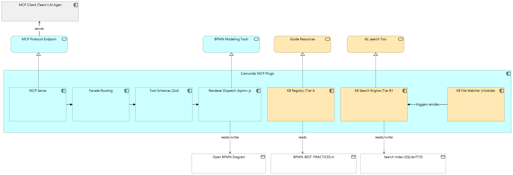
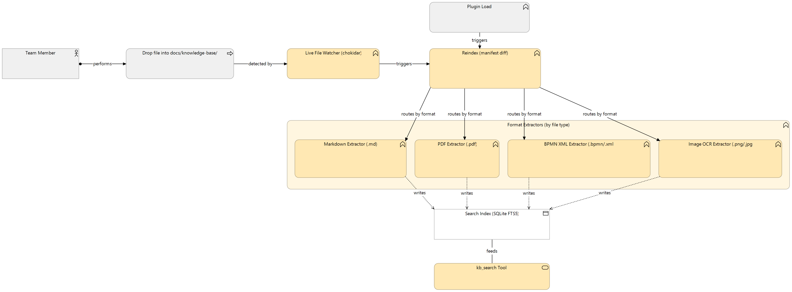
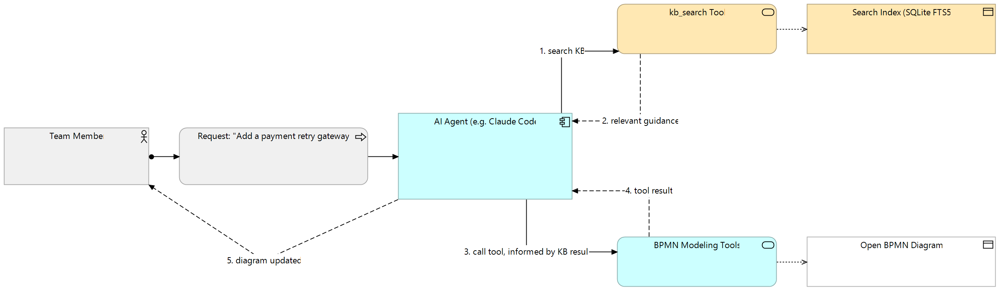

# Camunda-MCP Knowledge Base — Architecture

Tracks the design behind [#24](https://github.com/JesseLeresche/Camunda-mcp/issues/24). This
document explains what exists, why it's shaped this way, and how the pieces actually talk to
each other — the three diagrams below are the same model, exported from
[`Camunda-MCP-KB.archimate`](./Camunda-MCP-KB.archimate) (open it directly in
[Archi](https://www.archimatetool.com/) to explore or edit).

## Purpose

`BPMN-BEST-PRACTICES.md` already functions as this project's de facto knowledge base, but it's
invisible to the MCP protocol — it's only ever read because `CLAUDE.md` hard-instructs the
editor-side Claude Code agent to read it manually. No other MCP client can discover or fetch it.

This knowledge base makes that guidance (and a lot more) a first-class, protocol-level capability:
any MCP client connected to this plugin — not just one specific editor session — can discover and
use it.

## Two-tier design

Two tiers, built to solve genuinely different problems rather than one superseding the other:

| | Tier A — Curated Guides | Tier B1 — Searchable Corpus |
|---|---|---|
| **Answers** | "Give me *this specific* known document" | "I have a question, find what's relevant" |
| **Content** | A small, hand-curated set of Markdown guides | A larger, bulk-ingested, multi-format corpus |
| **Protocol** | MCP's native Resources (`resources/list` / `resources/read`) | A standalone tool (`kb_search`) |
| **Mechanism** | Static lookup table, reads a file off disk | SQLite FTS5 keyword index with BM25 ranking |

**Tier B1 does not replace Tier A when it's built.** They coexist — a document can even live in
both places at once (directly fetchable *and* searchable) with no conflict.

## Why FTS5, not vector search

Deliberately not a vector/embeddings store. FTS5 answers "which documents contain these words,"
not "which documents are conceptually similar" — a real capability gap versus embeddings, but one
accepted on purpose:

- **No model-inference step.** Generating an embedding requires running a chunk through a model —
  real compute or an API call, per chunk. FTS5 indexing is pure tokenization — no ML involved —
  which is why it stays fast regardless of corpus size at this scale. This was directly validated
  by a slow pgvector-based embedding pipeline on a separate project during this design's review.
- **Zero external dependency, zero per-query cost.** No embedding API, no vector database service.
- A WASM-SQLite-with-FTS5 shortcut (`sql.js-fts5`) was considered and rejected — confirmed
  abandoned (no releases in 5 years) before it was relied on.

BM25 (the ranking algorithm FTS5 uses) weighs both how often a search term appears in a document
*and* how distinctive that term is across the whole corpus — a rare, specific word counts for
more than a common one that appears everywhere. Same ranking family real search engines use.

## Component breakdown

The plugin decomposes into these pieces. **Blue = pre-existing**, **amber = new for the
knowledge base**.

- **MCP Server** (`src/server.ts`) — the `POST /mcp` JSON-RPC endpoint. Registers every tool and
  resource per request (stateless mode) and is the single entry point everything else hangs off.
- **Facade Routing** (`src/tools/handlers/facade.ts`) — `resolveFacade()`. Maps a public tool call
  (e.g. `add_element {operation:"task"}`) to its internal tool name (`add_task`). Runs first.
- **Tool Schemas (Zod)** (`src/tools/schemas/{primitives,public}.ts` + `SCHEMA_BY_TOOL` in
  `handlers.ts`) — validates params against the correct internal schema once the internal name is
  known.
- **Renderer Dispatch (bpmn-js)** (`client/bpmn-tools.ts`'s `TOOL_HANDLERS`) — the final stage:
  actually executes the validated, routed call against the live diagram open in the Modeler.
- **KB Registry (Tier A)** (`src/resources/registry.ts`) — a `ResourceDescriptor` list + a
  `readResource()` helper. Reads `BPMN-BEST-PRACTICES.md` live off disk — no content duplication,
  the file stays exactly as maintained today.
- **KB Search Engine (Tier B1)** (`src/knowledge-base/db.ts` + `kb_search` tool) — owns the SQLite
  FTS5 index and answers search queries with cited, highlighted excerpts.
- **KB File Watcher (chokidar)** (`src/knowledge-base/reindex.ts`'s live trigger) — watches
  `docs/knowledge-base/` while the plugin is running and triggers reindexing automatically.

Every call — BPMN tools, guide resources, and KB search alike — passes through the same MCP
Server entry point; the diagram omits explicit arrows for that to stay readable, but it's implicit
in all three components realizing services off the one server.

## Adding content

Contributing to Tier B1 is deliberately reduced to one action: **drop a file into
`docs/knowledge-base/`.** No command to run, no manual reindex step, no restart required.

### Supported formats

One extractor per type, all local and free — no external API calls, no per-file cost:

| Format | Extractor | Package |
|---|---|---|
| `.md` | used as-is | none |
| `.pdf` | text-layer extraction | [`pdfjs-dist`](https://www.npmjs.com/package/pdfjs-dist) (Mozilla-maintained, actively released, zero native deps) |
| `.bpmn` / `.xml` | element names, labels, `<documentation>` text pulled directly from the XML — exact, not guessed | none — the structure is small and predictable enough that a parsing library isn't needed |
| `.png` / `.jpg` (a photo or screenshot of a diagram) | OCR extracts visible text labels | [`tesseract.js`](https://www.npmjs.com/package/tesseract.js) (actively maintained, pure WASM, fully local) |

### Two reindex triggers, one shared function

- **Live, via `chokidar@4`** (pinned to v4, not v5 — v5 is ESM-only and this project's
  `tsconfig.json` is CommonJS): watches `docs/knowledge-base/` while the plugin is running,
  debounced via `awaitWriteFinish` so one save doesn't trigger several redundant passes.
- **At plugin load**: covers content that changed while the plugin wasn't running (e.g. pulled
  via git before Modeler was launched).

Both call the same manifest-diff `reindex()` function (mtime/hash per source file), which only
re-processes files that actually changed. **Correctness requirement this creates:** the generated
`.sqlite` file and its manifest must live *outside* `docs/knowledge-base/` — if the database were
inside the watched folder, the watcher would see its own writes and loop.

### Indexing granularity — two phases

- **Phase 1** (first deliverable): whole-document granularity — each file becomes one searchable
  row, across all four formats. Simpler to build, gives a real testable pipeline immediately.
- **Phase 2** (later, additive): heading/page/paragraph-level chunking for better precision on
  larger documents. Not designed in detail yet — deferred deliberately rather than guessed at.

## Real-world example

A concrete walk-through of the whole system working together: a team member asks the AI agent to
build or modify a diagram (*"Add a payment retry gateway"*). The agent (1) searches the knowledge
base before acting, (2) gets relevant guidance back, (3) calls a BPMN tool informed by that
guidance, (4) gets the tool's result, and (5) reports the updated diagram back to the team member.
This is the payoff of the whole design — the knowledge base isn't a side feature, it's meant to be
consulted as a normal part of every non-trivial diagram operation.

## Key dependencies

| Package | Role | Why this one |
|---|---|---|
| `better-sqlite3` | FTS5 index (Tier B1) | Real BM25 ranking + snippet extraction; synchronous API |
| `pdfjs-dist` | PDF text extraction | Mozilla-maintained, zero native deps |
| `tesseract.js` | Image OCR | Actively maintained, pure WASM, fully local |
| `chokidar` (v4) | Live file watching | Pure JS, wraps Node's `fs.watch`, no native compilation |
| `@electron/rebuild` (dev) | Rebuilds `better-sqlite3` against Modeler's Electron ABI | See risk below |

## Open risk: the one native dependency

`better-sqlite3` is the only piece of this design with real deployment risk, and it's specific to
*how* this plugin runs: it's a native (C++) addon, and this plugin is loaded directly into Camunda
Modeler's own already-built Electron process via a symlink — not through a build pipeline that
would normally rebuild native modules for the host's exact Node ABI. A binary built against a
generic local Node version will very likely fail with an ABI mismatch when Modeler tries to load
it.

**Mitigation, sequenced first in the build plan (see #24):** a small spike — install, rebuild
against Modeler's actual bundled Electron version via `@electron/rebuild`, and confirm it loads
live — *before* any schema or ingestion code gets written. If it fails, Tier B1 falls back to a
plain in-memory JS keyword search instead of SQLite. Team members never need to do this rebuild
themselves — the maintainer builds the binary once and ships it with the plugin.

## Future considerations (explicitly out of scope today)

- **Vision-model image descriptions.** OCR only recovers visible text labels — no understanding of
  a diagram's structure or meaning. A multimodal vision-model call could generate a real
  description instead, but that means an external API call (and per-image cost) for every image
  added, breaking this design's fully-local/zero-cost property. Revisit only if real usage shows
  OCR's label-only results are a meaningful gap in practice.
- **Phase 2 chunking**, as above.
- **Bulk content sourcing** (scraping Camunda/Zeebe docs, team members' own existing diagrams/PDFs)
  is tracked separately from the mechanism itself — this document, and #24, are about building the
  pipeline, not populating it.

## Related

- [#24 — Build a two-tier knowledge base](https://github.com/JesseLeresche/Camunda-mcp/issues/24)
- [#25 — Document the knowledge base](https://github.com/JesseLeresche/Camunda-mcp/issues/25)
- `archi-mcp-server`'s `ResourceRegistry` (commit `ba0bdcc`) — the direct inspiration for Tier A.
